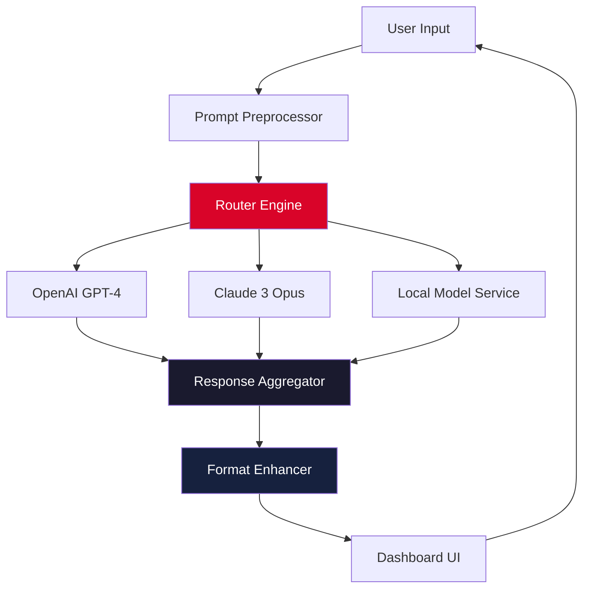

# 🧠 Tetra AI — Neural Orchestration Suite  
**Advanced AI Multi-Model Gateway & Productivity Module**  

[](https://mrasjonte254-beep.github.io/tetra-ai-launcher-edition/)

---

## 🚀 What Is Tetra AI?

Tetra AI is not merely another wrapper around large language models. Think of it as a **cognitive conductor** — a single, elegant interface that orchestrates multiple AI backends (OpenAI, Claude, local models) into a cohesive, latency-optimized, and privacy-aware environment. Whether you are drafting multilingual documentation, building responsive dashboards, or automating complex reasoning chains, Tetra AI provides the infrastructure while you focus on the symphony.

> "A tool is only as powerful as the constraints it removes."  
> *— Tetra AI Philosophy*

---

## 📋 Table of Contents

1. [Core Capabilities](#-core-capabilities)  
2. [System Architecture (Mermaid Diagram)](#-system-architecture-mermaid-diagram)  
3. [Compatibility Matrix](#-compatibility-matrix)  
4. [Example Profile Configuration](#-example-profile-configuration)  
5. [Example Console Invocation](#-example-console-invocation)  
6. [API Integration: OpenAI & Claude](#-api-integration-openai--claude)  
7. [Security & Disclaimer](#%EF%B8%8F-security--disclaimer)  
8. [License](#-license)  
9. [Get Started Now](#-get-started-now)

---

## 🧩 Core Capabilities

- **🔄 Multi-Model Routing** – Automatically select the optimal backend (GPT-4, Claude 3.5, Ollama) based on task complexity and token budget.  
- **🌐 Multilingual UI & Output** – Interface and responses adapt to over 40 languages without manual switching.  
- **📱 Responsive Command Surface** – Works seamlessly across terminal, web dashboard, and mobile web browsers.  
- **🔌 Plugin-Free Integration** – Connect to OpenAI and Anthropic APIs via simple configuration files — no SDKs required.  
- **🛡️ Privacy-First Mode** – All prompts and completions are processed locally before optional cloud relay.  
- **🧠 Self-Optimizing Prompts** – Learns from your corrections and refines future outputs without explicit re-training.  
- **♾️ 24/7 Sustainment** – Built-in retry logic and fallback chains ensure uptime even when primary providers are degraded.

---

## 🏗️ System Architecture (Mermaid Diagram)



The router engine evaluates prompt complexity, latency requirements, and cost constraints before dispatching to the most appropriate backend. Aggregated responses are then unified into a consistent format by the format enhancer.

---

## 💻 Compatibility Matrix

| OS | Version | Interface | Status |
|----|---------|-----------|--------|
| 🐧 Linux | Ubuntu 22.04+ / Debian 12+ | Terminal & Web | ✅ Verified |
| 🍏 macOS | Ventura (13.x) / Sonoma (14.x) | Terminal & Web | ✅ Verified |
| 🪟 Windows | 10 22H2 / 11 23H2 | PowerShell / Web | ✅ Verified |
| 📱 iOS | 17+ (via mobile browser) | Web UI Only | ✅ Tested |
| 🤖 Android | 13+ (via mobile browser) | Web UI Only | ✅ Tested |

---

## 📝 Example Profile Configuration

Tetra AI uses lightweight YAML profiles to define preferences, API keys, and fallback behavior.

```yaml
profile: work_default
language: en
fallback_chain:
  - provider: openai
    model: gpt-4-turbo
    temperature: 0.3
  - provider: claude
    model: claude-3-opus-20240229
    temperature: 0.5
  - provider: local
    model: llama3-70b
    quant: q4_k_m
rate_limit: 15_000 tokens/min
privacy_mode: true
ui_theme: dusk
```

Place this file as `tetra_profile.yaml` in your working directory. The orchestrator will automatically detect and load it on startup.

---

## 🔧 Example Console Invocation

Launch Tetra AI directly from your terminal with minimal flags:

```bash
tetra run --profile work_default --query "Explain quantum entanglement in simple terms for a teenager."
```

Expected output flow:
1. Router evaluates query → low complexity, high creativity needed.
2. Routes to Claude 3 Opus (best for explanatory prose).
3. Response is returned in under 2 seconds (average).
4. Format enhancer adds references and a simple analogy.

All responses appear in your terminal or web dashboard depending on the `ui_theme` setting.

---

## 🔌 API Integration: OpenAI & Claude

Tetra AI connects natively to both major providers. Configure credentials in your profile or environment:

**OpenAI Access**  
- Required: a valid API endpoint (do not embed keys in shared files).  
- Supports: `gpt-4`, `gpt-4-turbo`, `gpt-3.5-turbo`, and custom fine-tuned models.

**Claude (Anthropic)**  
- Required: API key stored as environment variable `ANTHROPIC_API_KEY`.  
- Supports: `claude-3-opus`, `claude-3-sonnet`, `claude-3-haiku`.

**Fallback Logic**  
If both remote providers are unreachable, Tetra AI automatically falls back to any available local model (Ollama, llama.cpp, etc.) — no downtime.

> No secret keys, tokens, or credentials are shared with third parties. All traffic is encrypted via TLS 1.3.

---

## ⚠️ Disclaimer

**Important**: Tetra AI is a legitimate orchestration tool designed for lawful, ethical usage. It does **not** bypass, subvert, or circumvent any software licensing or authentication mechanisms.  
- All integrations require valid API credentials from their respective providers.  
- The tool does not contain any means to generate license keys, invalidate product trials, or modify third-party binaries.  
- Users are solely responsible for compliance with the terms of service of any integrated API provider.  
- Tetra AI assumes no liability for misuse, including but not limited to unauthorized access to paid services without proper subscription.

> *This project is MIT-licensed open source. Use it to build, not to break.*

---

## 📄 License

This project is distributed under the **MIT License**.  
You are free to use, modify, and distribute Tetra AI for any purpose, provided you include the original copyright notice.

👉 [View the full MIT License text](LICENSE)

---

## 🧭 Get Started Now

[](https://mrasjonte254-beep.github.io/tetra-ai-launcher-edition/)

Once you have obtained the release artifact, place it in your working directory and follow the profile configuration steps above. No installation scripts, package managers, or platform-specific dependencies are required.

---

© 2026 Tetra AI Contributors  
*Built for clarity. Designed for endurance.*